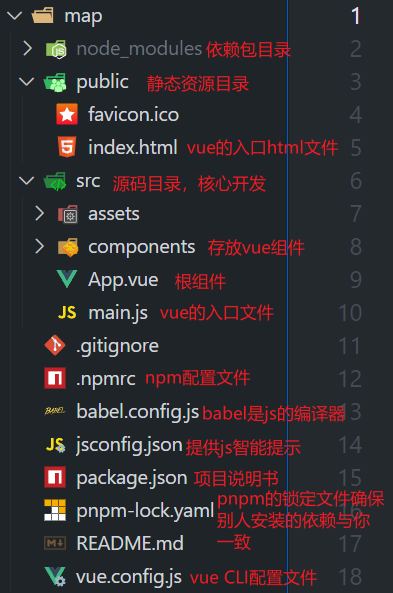

## 1.安装开发环境


Vue 3 项目需要 Node.js 环境。输入以下命令验证安装：

```bash
node -v
npm -v
```

Vue CLI 是 Vue.js 的官方脚手架工具，可帮助我们快速创建项目。在终端全局安装

```bash
npm install -g @vue/cli
```

安装完成后，输入以下命令验证安装：

```bash
vue -V
```


## 2.创建 Vue 3 项目

在终端中，进入你希望创建项目的目录，运行以下命令：

```bash
vue create map
```

系统会提示你选择预设，选择 `Default (Vue 3)`，然后按回车。

创建完成后，进入项目目录并启动开发服务器：

```bash
cd my-vue3-map
pnpm run serve
```

打开浏览器，访问 `http://localhost:8080`，你将看到 Vue 的欢迎页面。




## 3.集成高德地图

### 1. 注册高德开发者账号

前往 [高德开放平台](https://lbs.amap.com/) 注册账号，并申请 Web 端的 Key。

### 2. 安装高德地图插件

在项目根目录下，运行以下命令安装高德地图的加载器：

```bash
npm install @amap/amap-jsapi-loader
```

### 3. 创建地图组件

在 `src/components/` 目录下，创建一个名为 `MapContainer.vue` 的文件，内容如下：

```vue
<template>
  <div id="map" style="width: 100%; height: 500px;"></div>
</template>

<script>
import AMapLoader from '@amap/amap-jsapi-loader';

export default {
  name: 'MapContainer',
  mounted() {
    AMapLoader.load({
      key: '你的高德地图Key', // 替换为你的Key
      version: '2.0',
      plugins: [],
    })
      .then((AMap) => {
        new AMap.Map('map', {
          center: [116.397428, 39.90923], // 初始中心点
          zoom: 13, // 初始缩放级别
        });
      })
      .catch((e) => {
        console.error(e);
      });
  },
};
</script>

<style scoped>
#map {
  width: 100%;
  height: 500px;
}
</style>
```

### 4. 使用地图组件

在 `src/App.vue` 中，引入并使用 `MapContainer` 组件：

```vue
<template>
  <div id="app">
    <MapContainer />
  </div>
</template>

<script>
import MapContainer from './components/MapContainer.vue';

export default {
  name: 'App',
  components: {
    MapContainer,
  },
};
</script>
```

保存文件后，浏览器将自动刷新，并显示高德地图。

---

## ✅ 第五步：添加地图标记

我们可以在地图上添加标记点。修改 `MapContainer.vue` 中的 `then` 方法如下：

```javascript
.then((AMap) => {
  const map = new AMap.Map('map', {
    center: [116.397428, 39.90923],
    zoom: 13,
  });

  new AMap.Marker({
    position: [116.397428, 39.90923],
    map: map,
    title: '天安门',
  });
})
```

保存后，地图上将显示一个标记点。

[6]: 
