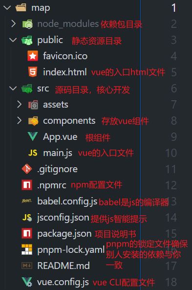

# 高德地图基础调用

## 1.安装开发环境

Vue 3 项目需要 Node.js 环境。输入以下命令验证安装：

```bash
node -v
npm -v
```

Vue CLI 是 Vue.js 的官方脚手架工具，可帮助我们快速创建项目。在终端全局安装

```bash
pnpm install -g @vue/cli
```

安装完成后，输入以下命令验证安装：

```bash
vue -V
```


## 2.创建 Vue 3 项目

在终端中，进入你希望创建项目的目录，运行以下命令：

```bash
vue create map
```

系统会提示你选择预设，选择 `Default (Vue 3)`，然后按回车。

创建完成后，进入项目目录并启动开发服务器：

```bash
cd map
pnpm run serve
```

打开浏览器，访问 `http://localhost:8080`，你将看到 Vue 的欢迎页面。




## 3.集成高德地图

### 1. 注册高德开发者账号

前往 [高德开放平台](https://lbs.amap.com/) 注册账号，并申请 Web 端的 Key。

### 2. 安装高德地图插件

在项目根目录下，运行以下命令安装高德地图的加载器：

```bash
pnpm install @amap/amap-jsapi-loader
```

### 3. 创建地图组件

在 `src/components/` 目录下，创建一个名为 `MapContainer.vue` 的文件，内容如下：

```vue
<template>
  <div id="map"></div>
</template>

<script>
import AMapLoader from '@amap/amap-jsapi-loader';

export default {
  name: 'MapContainer',
  mounted() {
    AMapLoader.load({
      key: '你的高德地图Key', // 替换为你的Key
      version: '2.0',
      plugins: [],
    })
      .then((AMap) => {
        new AMap.Map('map', {
          center: [116.397428, 39.90923], // 初始中心点
          zoom: 13, // 初始缩放级别
        });
      })
      .catch((e) => {
        console.error(e);
      });
  },
};
</script>

<style scoped>
#map {
  width: 100%;
  height: 500px;
}
</style>
```

### 4. 使用地图组件

在 `src/App.vue` 中，引入并使用 `MapContainer` 组件：

```vue
<template>
  <div id="app">
    <MapContainer />
  </div>
</template>

<script>
import MapContainer from './components/MapContainer.vue';

export default {
  name: 'App',
  components: {
    MapContainer,
  },
};
</script>
```

保存文件后，浏览器将自动刷新，并显示高德地图。

---

## ✅ 第五步：添加地图标记

我们可以在地图上添加标记点。修改 `MapContainer.vue` 中的 `then` 方法如下：

```javascript
.then((AMap) => {
  const map = new AMap.Map('map', {
    center: [116.397428, 39.90923],
    zoom: 13,
  });

  new AMap.Marker({
    position: [116.397428, 39.90923],
    map: map,
    title: '天安门',
  });
})
```

保存后，地图上将显示一个标记点。


## 功能复现

1. 初始化项目

打开终端，执行以下命令：

```bash
mkdir map
cd map
npm init -y
```

这将创建一个新的项目文件夹并初始化 `package.json` 文件。

2. 安装依赖

安装 Vue 3、Webpack 5 及其相关依赖：

```bash
npm install vue
npm install -D webpack webpack-cli webpack-dev-server vue-loader @vue/compiler-sfc html-webpack-plugin css-loader style-loader
```

3. 配置 Webpack

在项目根目录下创建 `webpack.config.js` 文件，内容如下：

```javascript
const path = require('path');
const { VueLoaderPlugin } = require('vue-loader');
const HtmlWebpackPlugin = require('html-webpack-plugin');

module.exports = {
  entry: './src/main.js',
  output: {
    path: path.resolve(__dirname, 'dist'),
    filename: 'bundle.js',
    clean: true,
  },
  resolve: {
    extensions: ['.js', '.vue'],
    alias: {
      '@': path.resolve(__dirname, 'src'),
    },
  },
  devServer: {
    static: './dist',
    hot: true,
    open: true,
    port: 8080,
  },
  module: {
    rules: [
      {
        test: /\.vue$/,
        loader: 'vue-loader',
      },
      {
        test: /\.css$/i,
        use: ['style-loader', 'css-loader'],
      },
    ],
  },
  plugins: [
    new VueLoaderPlugin(),
    new HtmlWebpackPlugin({
      template: './public/index.html',
    }),
  ],
};
```

4. 创建项目结构

创建以下目录和文件：

```
vue3-amap-demo/
├── public/
│   └── index.html
├── src/
│   ├── App.vue
│   └── main.js
├── webpack.config.js
├── package.json
```

在 `public/index.html` 中添加基本的 HTML 结构：

```html
<!DOCTYPE html>
<html lang="en">
<head>
  <meta charset="UTF-8" />
  <title>Vue 3 AMap Demo</title>
</head>
<body>
  <div id="app"></div>
</body>
</html>
```

在 `src/main.js` 中初始化 Vue 应用：

```javascript
import { createApp } from 'vue';
import App from './App.vue';

createApp(App).mount('#app');
```

在 `src/App.vue` 中添加基本的 Vue 组件结构：

```vue
<template>
  <div>
    <h1>Vue 3 AMap Demo</h1>
  </div>
</template>

<script>
export default {
  name: 'App',
};
</script>

<style>
/* 添加样式 */
</style>
```

### 5. 添加启动脚本

在 `package.json` 的 `scripts` 部分添加以下命令：

```json
"scripts": {
  "serve": "webpack serve --mode development",
  "build": "webpack --mode production"
}
```

现在，运行以下命令启动开发服务器：

```bash
npm run serve
```

打开浏览器访问 `http://localhost:8080`，你应该能看到 "Vue 3 AMap Demo" 的标题。

------

## 🗺️ 第二步：集成高德地图

### 1. 获取高德地图 API Key

前往 [高德开放平台](https://lbs.amap.com/) 注册账号，并申请 Web 端的 Key。

### 2. 安装高德地图加载器

在项目中安装高德地图的加载器：

```bash
npm install @amap/amap-jsapi-loader
```

### 3. 创建地图组件

在 `src` 目录下创建 `components/MapContainer.vue` 文件，内容如下：

```vue
<template>
  <div id="map" style="width: 100%; height: 500px;"></div>
</template>

<script>
import AMapLoader from '@amap/amap-jsapi-loader';

export default {
  name: 'MapContainer',
  mounted() {
    AMapLoader.load({
      key: '你的高德地图Key', // 替换为你的Key
      version: '2.0',
      plugins: [],
    })
      .then((AMap) => {
        new AMap.Map('map', {
          center: [116.397428, 39.90923], // 初始中心点
          zoom: 13, // 初始缩放级别
        });
      })
      .catch((e) => {
        console.error(e);
      });
  },
};
</script>

<style scoped>
#map {
  width: 100%;
  height: 500px;
}
</style>
```

### 4. 使用地图组件

在 `src/App.vue` 中引入并使用 `MapContainer` 组件：

```vue
<template>
  <div>
    <h1>Vue 3 AMap Demo</h1>
    <MapContainer />
  </div>
</template>

<script>
import MapContainer from './components/MapContainer.vue';

export default {
  name: 'App',
  components: {
    MapContainer,
  },
};
</script>

<style>
/* 添加样式 */
</style>
```

保存文件后，浏览器将自动刷新，并显示高德地图。

------

## ✅ 第三步：封装地图功能模块

为了更好地管理地图相关的功能，我们可以按照功能模块进行封装，类似于你提供的 Gitee 项目中的结构。以下是建议的目录结构：

```
src/
├── components/
│   └── MapContainer.vue
├── utils/
│   └── map/
│       ├── index.js
│       ├── MapMarker.js
│       ├── MapZone.js
│       ├── Event.js
│       ├── ContextMenu/
│       │   └── ContextMenu.js
│       └── Toggler/
│           ├── LayerToggler.js
│           ├── ScreenFullToggler.js
│           └── index.js
```

在 `utils/map/` 目录下，我们可以封装各种地图功能模块，例如：

- `MapMarker.js`：管理地图标记点的添加、删除等操作。
- `MapZone.js`：绘制和管理地图区域（如多边形、圆形等）。
- `Event.js`：封装地图事件的绑定和解绑。
- `ContextMenu/ContextMenu.js`：实现地图右键菜单功能。
- `Toggler/`：封装地图控件，如图层切换、全屏切换等。

在 `utils/map/index.js` 中统一导出这些模块，方便在组件中引入使用。

------

如果你希望我继续为你详细讲解如何实现上述功能模块中的某一个，例如如何封装 `MapMarker.js` 来管理地图标记点，请告诉我，我将继续为你提供详细的指导！
